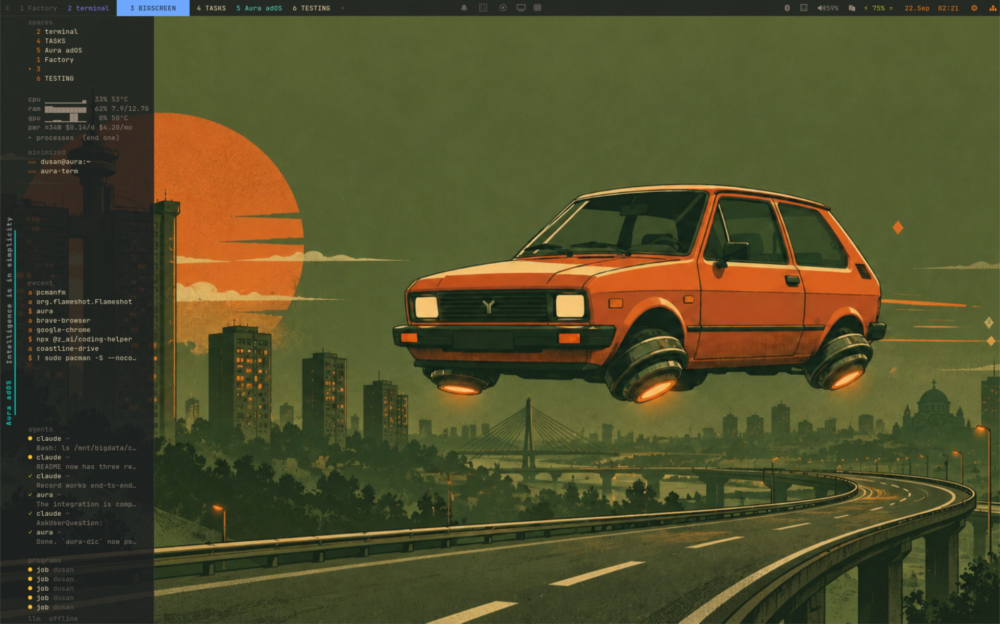
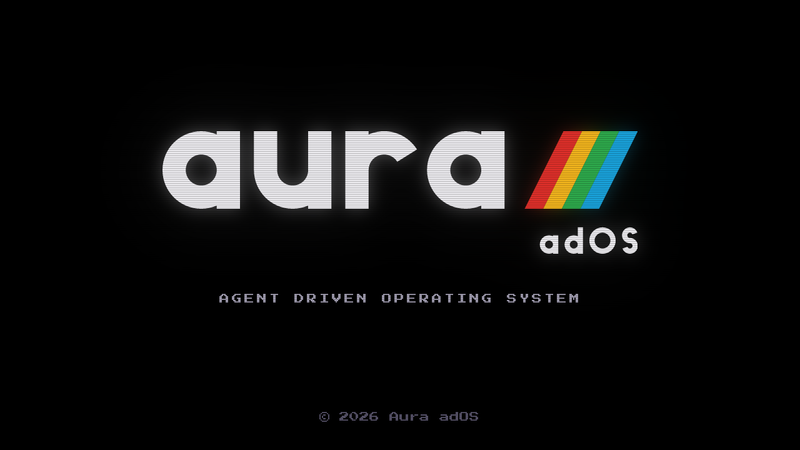
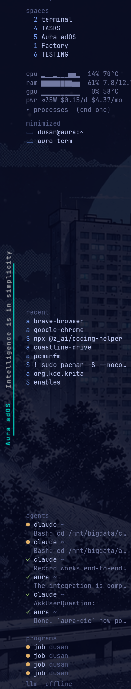
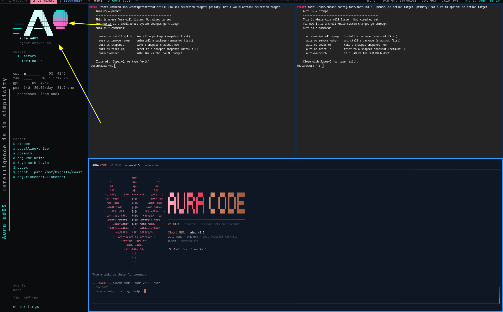

<h1>
  <picture>
    <source media="(prefers-color-scheme: dark)" srcset="assets/brand/aura-os-mark.svg">
    
  </picture>
</h1>

> Finally, your own OS on your own laptop — running what you need,
> nothing you don't. Aura built it for herself: she installs, themes,
> fixes and backs it up. You ask; Aura does it, snapshots first.




## Direction: a dev OS, not a polished one

Aura OS is a working desk for developers and their agents: text over
icons, square panes, every agent's last step in the sidebar, the
numbers that matter (RAM, the last 500 copies) one glance away. It runs
everything you run today — browsers, dev tools, media, games — on a
bare desktop under 350 MB. If it doesn't help you ship, it isn't on
screen.

## Screenshots

Boot splash:



The desktop: top bar with desktop tabs and the centre toggles
(silent · hotspot · record · cast · tiles); the left sidebar with every
workspace, live cpu/ram/gpu/power, minimized windows, the last things
used, and each agent's latest step. Text, one font, no icons wasted.



aura-term and AURA CODE, the agent's own terminal and coding session:



## Install

Aura OS is a layer on a fresh Arch Linux install.

```sh
git clone https://github.com/DusanCar-sudo/aura-os.git
cd aura-os
./install.sh            # runs install/01..09 in order; safe to re-run
./install.sh 03 05      # or just the steps you want
```

Every step is idempotent and snapshots first (snapper). `01` installs
packages, `03` sets up sway + greetd, `05` builds aura-term, `08` writes
the boot splash. The proprietary license ships the OS to users only as
a downloadable ISO — see LICENSE and THIRD-PARTY-NOTICES.md for the
GPL / foot-MIT obligations that make that work.

For development, test changes in the QEMU VM instead of on metal:

```sh
cd vm && ./run-vm.sh install    # first boot: archinstall, then clone repo
./run-vm.sh                     # later boots
```

## Two projects in one

1. **The OS** — a layer on Arch Linux: install script,
   sway dotfiles, `aura-os-*` commands, and Aura as the operator.
2. **Aura herself** — Aura builds most of this from instructions. Where she
   stumbles (wrong tool, wrong surface, runaway commands), the fix goes into
   aura-code, not just this repo. The method is in [METHOD.md](METHOD.md).

## Layout

    vm/            QEMU test VM (run-vm.sh — artifacts not in git)
    install.sh     entry point, run on a fresh Arch install   (Aura builds)
    install/       ordered install steps                      (Aura builds)
    config/        sway, Waybar, fuzzel, mako dotfiles        (Aura builds)
    bin/aura-os-*  the only commands Aura may use for system changes
    term/          aura-term, a foot fork (MIT) — the agent's terminal
    rust/          egui apps: settings, sysmon, files, keyboard…
    lib/           shared Python helpers for the bin/ commands
    themes/        swappable themes
    AURA.md        standing rules Aura loads for this repo

## Contributing & security

This is a personal OS built in the open; issues and discussion are
welcome, but large changes should start as an issue first. Report
security problems privately via GitHub rather than in a public issue.
