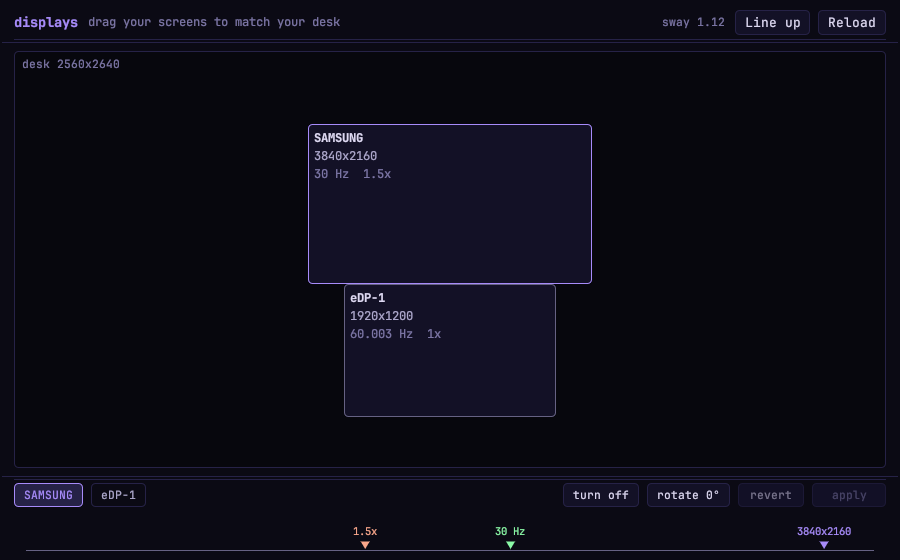

# Aura Optanomai

A small, flat, monospace window that shows the screens plugged into your PC as
rectangles you can push around until they match how the monitors actually sit on
your desk. One horizontal track with three coloured arrows — resolution,
refresh, scale — drives everything.

It wears the **aura theme** your desktop is already wearing, and renders in
JetBrains Mono. Nothing about it should look like it came from somewhere else.



<sub>With no aura theme present it falls back to the OS light/dark preference:
[`docs/screenshot-fallback-light.png`](docs/screenshot-fallback-light.png)</sub>

It runs on **sway** and changes your layout for real, through `swaymsg`.

## Running it

```sh
cargo run --release
```

The binary lands at `target/release/aura-optanomai`. It is symlinked onto `PATH`
as `aura-optanomai`, so it can also just be launched by name or from fuzzel:

```sh
aura-optanomai >/dev/null 2>&1 & disown
```

## The one control

Everything lives on a single line:

```
    1.5x                    30 Hz                    3840x2160
     ▼                        ▼                          ▼
  ───┴────────────────────────┴──────────────────────────┴──────
  scale (accent+120°)   refresh (accent+240°)   resolution (accent)
```

Drag an arrow along the track to change its setting. The arrow jumps to the
pointer, and while you drag, faint ticks show every position it can snap to. The
three move independently — each has its own list of options — and the labels
above them shuffle themselves apart so they never overprint.

Turning an arrow reshapes the monitor tile immediately, so you can see what a
resolution or scale change does to your layout *before* committing to it.

## Following the aura theme

`aura-theme` records the active theme in `~/.config/aura/theme`, and each theme
is a flat `key=value` file at `<aura-share>/themes/<name>.conf` holding seven
colours. This app reads **that same file**, so switching themes switches the app
with it — no restyling, no rebuild, no second place to keep in sync.

The app resolves `<aura-share>` exactly the way `lib/common.sh` does:
`$AURA_SHARE` if set, otherwise two directories up from the `aura-theme` on
`PATH`. User themes in `~/.config/aura/themes/` win over the shipped ones, as
they do for every other aura tool.

| aura token | becomes |
| --- | --- |
| `BG` | panel background, and the desk well is a recess below it |
| `SURFACE` | monitor tiles |
| `LINE` | hairline borders |
| `FG` | text |
| `DIM` | hints, units, the desk caption |
| `ACCENT` | the window title, selection, apply button, resolution arrow |
| `ACCENT2` | "you have unsaved edits", and errors |

`RADIUS` is honoured too, so `paper` gets its 6px and `violet-dusk` its 4px.

### The three arrows

A theme only has two accents, but three arrows have to be tellable apart on one
line. So the arrows are the accent and the two colours **120° and 240° around
the colour wheel** from it, keeping the accent's saturation and lightness. Any
theme's accent yields a balanced triad that belongs to it.

On `violet-dusk` that gives violet for resolution, green for refresh and salmon
for scale. On `ocean-depth` it gives blue, amber and teal.

A theme with no hue to spin — `mono`, `paper` — falls back to the default triad
instead of inventing one.

`ACCENT2` is kept for meaning rather than for arrows: it is what aura itself
puts in `client.urgent`, so it is what the app uses when sway rejects a command
or when two screens end up overlapping.

### When there is no aura theme

The app falls back to the OS light/dark preference, dressed in Catppuccin
**Mocha** or **Latte**, read from (in order) the XDG settings portal, `gsettings`,
then `~/.config/gtk-{4,3}.0/settings.ini`.

The theme is re-checked every couple of seconds either way, so it follows a
theme switch live.

`AURA_OPTANOMAI_THEME=dark|light` pins the fallback scheme, which is handy for
seeing the fallback palette on a machine that has an aura theme installed.

## Font

The official **JetBrains Mono 2.304** is compiled into the binary, so the app
renders identically everywhere — no fontconfig lookup, no dependence on what you
happen to have installed. Two faces are embedded: Regular for everything, Bold
for the window title and the monitor names.

The aura themes name a font stack as well, but `paper` asks for IBM Plex Sans —
a proportional face, which would wreck a layout built on a grid. The embedded
monospace wins.

`AURA_OPTANOMAI_FONT=/path/to/font.ttf` replaces the regular face if you would
rather look at something else. egui's bundled fonts sit behind JetBrains Mono as
glyph fallbacks, so a character it doesn't cover degrades to something rather
than a tofu box. The font is under the SIL Open Font License 1.1 — see
[`crates/aura-ui/assets/OFL.txt`](../../crates/aura-ui/assets/OFL.txt).

## What it does

- **Shows every connected screen** in its true relative position and size, with
  its real resolution, refresh rate and scale written on it.
- **Drag a screen to move it.** Tiles snap to each other's edges, tops, bottoms
  and centres, with hairline guide lines showing what they locked onto. Nothing
  is sent to the compositor until you press **apply**.
- **turn off / turn on / rotate** the selected screen.
- **Line up** tidies every screen into a row with their tops flush.
- **revert** throws away your edits and re-reads what the compositor is doing.
- If two tiles end up overlapping, both get an outline in the theme's alert
  colour — that's a layout that can't happen on a real desk.

## Making the window float

Sway tiles new windows by default, which stretches this one down the whole
screen. To have it open as a proper little floating window, add this to
`~/.config/sway/config`:

```
for_window [app_id="aura-optanomai"] floating enable, resize set 900 560, move position center
```

## Keyboard

| Key | Action |
| --- | --- |
| `Ctrl`+`R` | Re-read the layout from the compositor |

## How it works

The app never links against sway. It shells out to `swaymsg`, which is a small,
stable, documented interface:

- `swaymsg -t get_outputs -r` to read the topology (JSON, parsed with serde).
- `swaymsg output <name> mode|position|scale|transform|enable|disable` to change it.

Commands are generated by a pure function, `displays::plan()`, which takes the
list of screens and returns the exact commands needed to get from the current
state to the edited one. Keeping that pure means the whole command-building
logic is unit tested without a compositor anywhere in sight.

Three details that `plan()` exists to get right:

- **Order matters.** Mode, scale and rotation all change how much room a screen
  occupies, so they are set first and the position is set last.
- **Positions need a space, not a comma.** `output DP-1 position 1920 0`, not
  `1920,0` — sway rejects the comma form with "Missing position argument (y)".
- **Refresh rates are carried in millihertz**, exactly as sway reports them, and
  formatted back out to three decimals (`60.003Hz`), so `1920x1200@60.003Hz`
  round-trips to the precise mode instead of drifting to the nearest whole
  number. If sway still refuses an exact rate, the command is retried without
  it and sway picks the best refresh for that resolution.

## Tests

```sh
cargo test
```

42 tests. Besides the obvious ones — mode formatting and round-tripping, the
rotation maths, how scale and portrait rotation change a screen's footprint,
which sway commands a given edit generates, the edge-snapping and guide-line
maths — they cover the theme layer:

- the aura `key=value` format parses, and a theme **missing a token is rejected**
  rather than painted half-way;
- hex parsing is strict, and HSL conversion round-trips;
- **the three arrows are always tellable apart**: for every shipped aura theme,
  and for both fallback palettes, each pair of arrows is asserted to be more
  than 60° apart in hue. That test caught the fallback triads having blue and
  mauve only ~50° apart, which is not a distinguishable pair on one line;
- a monochrome theme falls back to the default triad rather than inventing a
  hue, and a light theme gets the light triad;
- the embedded font files really are TrueType faces and really differ.

Two tests read this machine directly and are strictly read-only, so they are
safe to run any time: `reads_the_real_compositor_without_touching_it` (parses
real `swaymsg` output and asserts an untouched layout produces zero commands)
and `reads_the_real_aura_theme` (loads the live theme file).

## Layout of the source

| File | What's in it |
| --- | --- |
| `src/main.rs` | Window setup and entry point |
| `src/app.rs` | The window: header, control bar, wiring the track to the screens |
| `src/canvas.rs` | The desk — tiles, dragging, edge snapping, guide lines, painting |
| `src/slider.rs` | The track and its three coloured arrows |
| `src/displays.rs` | Talking to sway: reading outputs, planning and running commands |
| `src/theme.rs` | Aura theme loading, colour maths, the fallback scheme, fonts |
| `assets/` | The embedded JetBrains Mono faces and their OFL licence |

## Requirements

- A **sway** session (it will say so plainly and refuse to pretend otherwise if
  it can't find `swaymsg`).
- To build: a Rust toolchain, plus the usual Wayland/X11 development packages
  that `winit` needs.
- An aura theme is optional. Without one the app falls back to the OS light/dark
  preference, for which it wants `gdbus`/`gsettings`. No font packages are
  needed — the font is embedded.

---

*ὀπτάνομαι — "to appear, to be seen". An Aura tool.*
